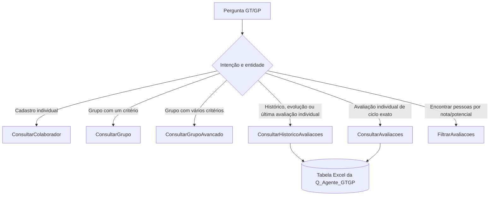

# Implementação de consultas de avaliações GT/GP — estado em 07/10/2026

## Situação

Implementação enviada e publicada no ambiente `portalusiminas (Upgrade)`. O Copilot Studio confirmou seis ferramentas `Flow`, e um clone remoto posterior confirmou a nova ação, o vínculo ao fluxo e a preservação dos cinco IDs funcionais existentes. O código foi registrado em `f02fceb` e enviado em fast-forward para `origin/master`; o checkout principal permaneceu intacto com as alterações staged e unstaged que já existiam.

## Arquitetura

| Ferramenta | Responsabilidade | Estado remoto observado |
|---|---|---|
| ConsultarColaborador | Cadastro e dados profissionais individuais | Presente, associada ao fluxo `d898fc48-61a5-f111-b8dd-00224808b0ee` |
| ConsultarGrupo | Grupo por um critério | Presente |
| ConsultarGrupoAvancado | Grupo por múltiplos critérios | Presente |
| ConsultarHistoricoAvaliacoes | Histórico, evolução e últimos resultados individuais | Publicada, ID `ac8d52b3-53b0-4b27-8879-c2e37214ae25`, fluxo `08a908f4-b61a-497c-b2e0-14fec8f5eedd` |
| ConsultarAvaliacoes | Ciclo individual explícito | Presente; fluxo atualizado e publicado |
| FiltrarAvaliacoes | Encontrar pessoas por nota e/ou potencial | Presente |

A nova ferramenta aceita somente `campo` (`Nome` ou `Matricula`) e `valor`. O fluxo consulta a tabela uma vez, projeta `Matricula`, `Nome`, `StatusAvaliacao`, `HistoricoAvaliacoes`, `UltimoCicloAvaliacao`, `UltimaNota` e `UltimoPotencial`, e responde com `status`, `resultado` (JSON serializado) e `quantidade` (colaboradores). Nomes ambíguos produzem apenas identificação mínima. A máscara de performance é aplicada antes da resposta. Estados previstos: `encontrado`, `nao_encontrado`, `multiplos`, `restrita`, `sem_avaliacoes`, `entrada_invalida` e `erro_tecnico`.

O fluxo de ciclo mantém o ID atual e o caminho legado sem ciclo para reduzir risco a consumidores existentes. Para ciclo explícito, converte `AAAA.1` em `AAAA_1` antes de acessar as chaves dinâmicas `Nota_<ciclo>` e `Potencial_<ciclo>` após a consulta: essa é a forma técnica confirmada nos cabeçalhos da tabela atual. Retira o `$select` dinâmico que incluía nomes de colunas com ponto e impedia a consulta pelo Excel Online Business. Projeta somente campos autorizados na resposta. O ciclo é validado no formato `AAAA.1` ou `AAAA.2`, sem lista fixa de anos. O fluxo diferencia `ciclo_invalido`, `ciclo_inexistente` e `sem_avaliacao` e retorna candidatos mínimos para nome ambíguo. Testes sintéticos pós-publicação confirmaram execução sem erro de `$select`; leitura de linha correspondente e comparação dos valores reais ainda não foram exercitadas.

## Alterações locais desta execução

- Criados `actions/FL_GTGP_ConsultarHistoricoAvaliacoes.mcs.yml` e `workflows/FL_GTGP_ConsultarHistoricoAvaliacoes-08a908f4-b61a-497c-b2e0-14fec8f5eedd/{metadata.yml,workflow.json}`. O novo ID de fluxo é `08a908f4-b61a-497c-b2e0-14fec8f5eedd`.
- Recuperados do clone remoto `actions/FL_GTGP_ConsultarColaborador_QoI.mcs.yml` e os arquivos do workflow `FL_GTGP_ConsultarColaborador-d898fc48-61a5-f111-b8dd-00224808b0ee`, que haviam desaparecido no checkout local.
- Ajustados `actions/FL_GTGP_ConsultarAvaliacoes.mcs.yml`, `agent.mcs.yml` e o workflow de `ConsultarAvaliacoes` para separar a intenção de histórico da de ciclo e tratar colunas dinâmicas sem `$select` inválido.
- `ConsultarColaborador` mantém seu identificador e vínculo remoto. Seu fluxo agora projeta os campos de perfil e exclui nota, potencial, etapa e comentários antes de serializar a resposta; o contrato ainda precisa de teste no runtime.
- `ConsultarGrupo`, `ConsultarGrupoAvancado` e `FiltrarAvaliacoes` não foram modificados por esta execução. O checkout já tinha alterações staged e unstaged nesses e em outros arquivos; elas foram preservadas.

## Sincronização e proteção

- Ambiente confirmado por `pac auth who`: `portalusiminas (Upgrade)`, organização `d1a088ee-6a6d-426e-a911-c3c963c0a6db`; agente `e92629ac-59a5-f111-b8dd-00224808b0ee`. PAC CLI `2.12.2` em `C:\Users\Igor\.dotnet\tools\pac.exe`.
- Backup integral anterior ao pull: `C:\Users\Igor\.codex\backups\power-platform-automation-gtgp-20261007-01`; 442 arquivos e zero diferenças SHA-256 no momento da cópia. Inclui `.git`, índice e alterações locais.
- `pac copilot pull` aplicado **somente** à cópia isolada em `C:\Users\Igor\.codex\backups\gtgp-isolated-pull-20261007\Agente - GT GP`: `Pull complete. 6 change(s) applied.` O checkout principal não foi sobrescrito pelo pull.
- Clone remoto independente em `C:\Users\Igor\.codex\backups\gtgp-remote-clone-20261007\Agente - GT GP` confirmou cinco arquivos de ações funcionais, cinco workflows e os vínculos. O componente antigo `FL_GTGP_ConsultarColaborador` (`f2d92b1f-04d2-495e-9853-bb2d41c9b4dc`) tem diálogo `{}` e aparece como tópico; a ferramenta funcional é `FL_GTGP_ConsultarColaborador_QoI` (`7c129a98-d1af-4ff7-96e1-66792cac6da4`). Nenhum deles foi removido.
- Clone fresco de implantação em `C:\Users\Igor\.codex\backups\gtgp-deploy-clone-20261007\Agente - GT GP` serviu de base para sincronizar apenas as alterações desta entrega. O push criou a action `ConsultarHistoricoAvaliacoes` com ID `ac8d52b3-53b0-4b27-8879-c2e37214ae25` e vinculou o workflow `08a908f4-b61a-497c-b2e0-14fec8f5eedd`.
- Um segundo clone remoto, em `C:\Users\Igor\.codex\backups\gtgp-after-push-20261007\Agente - GT GP`, confirmou seis actions, seis workflows e seis vínculos únicos. Os IDs funcionais anteriores permaneceram: Avaliações `9a27ea32-3252-4692-800c-0374aca29ed5`; Colaborador `7c129a98-d1af-4ff7-96e1-66792cac6da4`; Grupo `893d6c0f-4d6b-411c-add3-545f85b6e6d9`; GrupoAvancado `8d88275b-77e1-4541-9e4f-11f1bd882dc7`; FiltrarAvaliacoes `7650ed50-e3df-4312-817e-dcedf1e5c90e`. O componente vazio de mesmo nome continua sendo tópico e não conta como ferramenta.
- `pac copilot pack` falhou também no clone limpo de implantação: `Unsupported file: connectionreferences.mcs.yml. Unsupported directory: actions/. Unsupported directory: workflows/.` A sincronização foi feita pelo comando independente `pac copilot push`, a partir do clone vinculado ao agente; um clone remoto novo e a lista do Studio confirmaram o estado resultante. O erro de `pack` permaneceu registrado, mas não bloqueou a sincronização direta.
- A inspeção somente de cabeçalhos no Excel atual confirmou a tabela `Q_Agente_GTGP` na aba `TB_Agente`, com 48 colunas e 164 registros aparentes, incluindo `RestricaoPerformance`, `StatusAvaliacao`, `HistoricoAvaliacoes`, `UltimoCicloAvaliacao`, `UltimaNota`, `UltimoPotencial`, `Nota_2026_1`, `Nota_2026_2`, `Potencial_2026_1` e `Potencial_2026_2`. A aba `Base_Principal` contém a tabela `TB_Base_Principal`, com 43 colunas e 164 registros aparentes. Esses números vêm da área usada da planilha, não de uma contagem executada pelo conector.
- O workflow remoto restaurado de `ConsultarColaborador` usa uma tabela Excel diferente da de avaliações (`{F1563303-159D-4D69-BCC0-E86A511D0871}` versus `{0E6150C4-AD01-4E2A-8044-06CE76D7AF0D}`) e serializava a linha filtrada inteira em `resultado`. A tabela `TB_Base_Principal` contém `Nota 2026.1`, `Nota 2026.2`, `Potencial 2026.1`, `Potencial 2026.2`, `Etapa 2026.2` e `Comentários`. O fluxo local agora usa uma projeção explícita que não inclui esses campos. Isso reduz exposição de performance por meio da ferramenta cadastral, sem alterar seu ID ou filtro; a compatibilidade do contrato ainda precisa ser confirmada no ambiente.
- O comando `pac copilot publish` retornou `Published successfully ... Succeeded` em 07/10/2026. `pac copilot list` confirmou o agente como `Published`; a lista do Copilot Studio mostrou `Flow (6)`.
- **PAC push: concluído e verificado por clone remoto; publicação: concluída e confirmada; ferramentas funcionais publicadas: seis.**

## Testes e evidências

Validação estática: seis ações com `flowId`, seis workflows JSON parseáveis e seis vínculos únicos; as entradas do histórico são somente `text`/`text_1`; o `$select` do histórico é estático e foi removido da consulta por ciclo; a projeção cadastral exclui campos de avaliação. `git diff --check` e `git diff --cached --check` passaram. Os testes sintéticos confirmaram execução dos três fluxos, mas não exercitaram uma linha correspondente, os campos projetados ou uma avaliação restrita. A publicação foi confirmada separadamente por PAC e pela lista do Studio.

| ID | Prompt resumido sem dados pessoais | Ferramenta utilizada | Status | Diagnóstico |
|---|---|---|---|---|
| 20 | Histórico completo de uma colaboradora | ConsultarAvaliacoes, versão remota anterior | Falhou no baseline real | Copilot Studio pediu ciclo apesar de a entrada `Ciclo específico` estar vazia. |
| 21 | Última nota | — | Não executado após alteração | Depende de implantação segura e teste real. |
| 22 | Último potencial | — | Não executado após alteração | Idem. |
| 23 | Última avaliação | — | Não executado após alteração | Idem. |
| 24 | Todos os ciclos | — | Não executado após alteração | Idem. |
| 51 | Histórico completo por nome parcial | — | Não executado após alteração | Idem. |
| 52 | Evolução das avaliações | — | Não executado após alteração | Idem. |
| 53 | Notas e potenciais já recebidos | — | Não executado após alteração | Idem. |
| 54 | Histórico por matrícula | — | Não executado após alteração | Idem. |
| 55 | Avaliação mais recente em acompanhamento | — | Não executado após alteração | Idem. |
| 56 | Matrícula inexistente | — | Não executado após alteração | Idem. |
| 57 | Nome ambíguo | — | Não executado após alteração | Idem. |
| 58 | Pessoa sem avaliações | — | Não executado após alteração | Exige registro real autorizado ou fixture controlada. |
| 59 | Avaliação restrita | — | Não executado após alteração | Exige prova de ausência de valores protegidos na resposta. |
| 60 | Ciclo antigo após inclusão histórica | — | Não executado após alteração | Depende de confirmação da base atual. |
| 61 | Nota e potencial em ciclo 2026.1 | — | Não executado após alteração | Depende de teste do conector sem `$select`. |
| 62 | Avaliação em ciclo 2026.2 | — | Não executado após alteração | Idem. |
| 63 | Nota em ciclo 2023.2 | — | Não executado após alteração | Idem. |
| 64 | Potencial por matrícula em ciclo 2026.1 | — | Não executado após alteração | Idem. |
| 65 | Ciclo válido sem avaliação | — | Não executado após alteração | Idem. |
| 66 | Ciclo inexistente | — | Não executado após alteração | Idem. |
| 67 | Avaliação restrita em ciclo | — | Não executado após alteração | Exige prova de ausência de valores protegidos. |
| 01–08 | Consultas cadastrais individuais | — | Não reexecutado após alteração | Deve preservar `Consultar Colaborador`. |
| 11–13, 15–16, 18 | Grupos, RH, GT/GP e enquadre | — | Não reexecutado após alteração | Fluxos coletivos mantidos. |
| 34, 44–47 | Etapa, nomes parciais, inexistência e ambiguidade | — | Não reexecutado após alteração | A seleção da ferramenta mudou nas instruções locais. |

### Testes adicionais no rascunho

| Caso | Entrada | Resultado verificado |
|---|---|---|
| Histórico sem ciclo | Nome sintético inexistente | Acionou `ConsultarHistoricoAvaliacoes`; fluxo completou em 6,74 s com `nao_encontrado`, `[]` e quantidade `0`; o agente não pediu ciclo. Nenhum dado real de colaborador foi consultado. |
| Ciclo explícito | Mesmo nome sintético, ciclo `2026.1` | Acionou `ConsultarAvaliacoes`, enviou `Nome`, o valor sintético e `2026.1`; fluxo completou em 3,44 s com `nao_encontrado`, `[]` e quantidade `0`. O conector respondeu sem o erro de `$select`. Não exercitou a leitura de uma linha correspondente. |
| Projeção cadastral | Nome sintético inexistente | Acionou `ConsultarColaborador`; concluiu em 0,89 s com `nao_encontrado` e `[]`. Não havia linha para inspecionar a projeção. O painel mostrou depois um cartão de conexão Excel Online; não foi aceito. |

## Git

- Branch de destino: `master`; remoto: `origin/master`.
- Commit da implementação: `f02fceb` (`feat(gtgp): split evaluation history and cycle-specific queries`).
- Git push: concluído em fast-forward, de `716ebf5` para `f02fceb`. `master` não exige PR nem proteção de branch; merge não foi necessário.
- O commit foi preparado em uma árvore isolada com o snapshot remoto completo das seis ferramentas. O checkout principal manteve suas alterações staged/unstaged e arquivos não rastreados preexistentes, sem reset ou limpeza; por isso, seu `HEAD` local continua em `716ebf5` até a reconciliação local.

## Pendências de validação e Git

1. Completar os testes com uma fixture de colaborador autorizada: histórico existente, nome parcial/ambíguo, ciclo existente e ciclo sem avaliação. Validar a máscara em uma linha restrita sem mostrar valores de performance.
2. Reconciliar o cache `.mcs` do checkout principal com o commit `f02fceb` sem sobrescrever alterações staged/unstaged preexistentes; o GitHub já contém a versão publicada.
3. Consultas coletivas que combinam grupo e avaliação continuam fora do escopo desta alteração e não foram implementadas.
